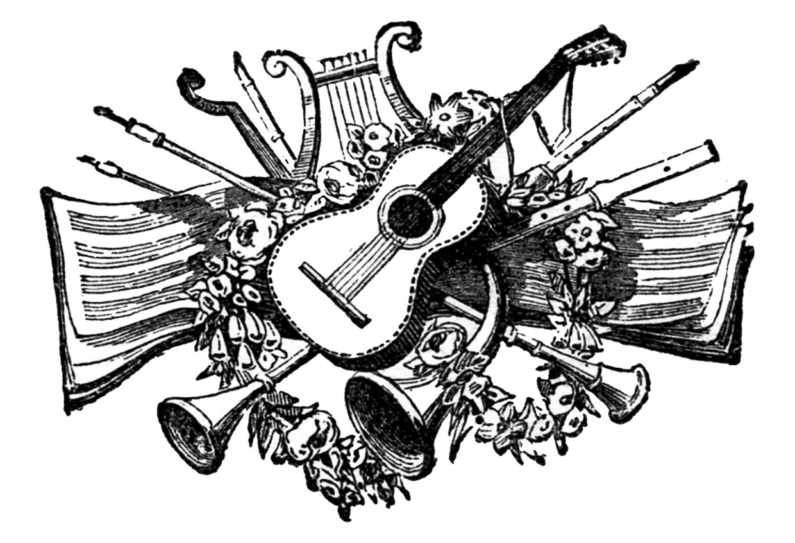

# Effects-of-Music on Various Aspects

# About
Music has become apart of our lives. Music is *everywhere*. Most cars have a radio installed having easy access to music or bluetooth. Since music is everywhere, there are various effects that it has on humans and other living things. 

> “I think music in itself is healing. It’s an explosive expression of humanity. It’s something we are all touched by. No matter what culture we’re from, everyone loves music.” —Billy Joel

# Music Effects:
* Human 
   * Brain
   * Mood
   * Heart
   * Health
* Plants 
   * Growth 

# Music's Affect on Humans
## Brain-  
There have been studies that show an increase in brain growth. Music has shown an increase in memorization as well. Music can trigger an emotion which then triggers a memory. A study was made in 2014, where 89 dementia patients were put to listen to music for 10 weeks or sing for 10 weeks and the effect was **positive**. They seemed to remember some songs. 

## Mood- 
Different genres of music affect a person's mood. Even sad music can become beneficiary because it becomes an outlet to **vent**. Upbeat music can lift a person's mood. The lyrics can be relateable which helps people feel like they are not alone.

## Heart- 
Some surgeons have done open heart surgery while playing Mozart or other classical music and have noticed the patient recover quickly and the soft music allows the doctor to relax.

## Health- 
Music has helped people with health issues. Tourettes is widely known to be helped by singing. Stress and anxiety are common and music helps relax and calm.   

# Music for Humans
   1. [Relaxation](https://www.youtube.com/watch?time_continue=7&v=o5crUrbVnfs)

   1. [Sonata no.23- Beethoven](https://www.youtube.com/watch?time_continue=22&v=rP4pSomJnDE)

   1. [Meditation](https://www.youtube.com/watch?v=7MqF0d0PQMc)
   
# The Effect of Music on Plants
## Growth- 
Music is a stimuli recieved by a plant. Music releases vibrations that the plant cells can feel. Since the plants cells are moving, they stimulate the production of nutrients leading to an increase of height. Rock music is not ideal for plant growth even though rock music produces greater pressure on the plant cells. Classical music is better for plant growth because the pressure from the vibrations are stable.

# Music for Plants
   1. [Plantasia](https://www.youtube.com/watch?v=hnYSayGjlnY)

   1. [A Warm Breeze](https://www.youtube.com/watch?v=zP4b3G2m9aQ)

   1. [Red Roses](https://www.youtube.com/watch?v=c7s4_DTjai0)

# Further Development
* different aspects on impact of music on human and plants
* list some songs
## Articles/Sites
   * https://www.thetabernaclechoir.org/articles/the-powerful-effect-of-music-on-the-brain.html
   * https://news.usc.edu/102681/childrens-brains-develop-faster-with-music-training/
   * https://owlcation.com/social-sciences/The-Effect-of-Music-on-Human-Health-and-Brain-Growth
   * https://www.gardeningknowhow.com/garden-how-to/info/how-music-affects-plant-growth.htm

